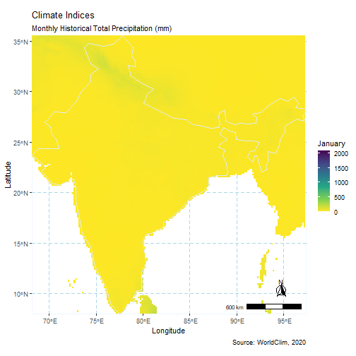

# Downloanding the data sets

The data used in this post comes from the WorldClim project, and can be retrieved [here](https://www.worldclim.org/data/monthlywth.html). Note that one of the authors of the project is professor Robert J. Hijmans, he is also responsible for the [raster package](https://cran.r-project.org/web/packages/raster/index.html).

Of course, some of the WorldClim project data is available through the raster package...


```r
    library(raster, quietly = TRUE)

    wc_prec_series <- getData(name = "worldclim", 
                              
                              var = 'prec',        # variable
                                          
                              res = 10,            # spatial resolution
                                          
                              lon = 5, lat = 45,
                                          
                              download = TRUE)
    
    wc_prec_series
```

```
## class      : RasterStack 
## dimensions : 900, 2160, 1944000, 12  (nrow, ncol, ncell, nlayers)
## resolution : 0.1666667, 0.1666667  (x, y)
## extent     : -180, 180, -60, 90  (xmin, xmax, ymin, ymax)
## crs        : +proj=longlat +datum=WGS84 +no_defs 
## names      : prec1, prec2, prec3, prec4, prec5, prec6, prec7, prec8, prec9, prec10, prec11, prec12 
## min values :     0,     0,     0,     0,     0,     0,     0,     0,     0,      0,      0,      0 
## max values :   885,   736,   719,   820,   955,  1850,  2088,  1386,   904,    980,    893,    914
```

The `getData` function, with the parameters used in the chunk above, downloads a RasterStack with 12 layers!

From the package documentation:

*"The data is available at the four spatial resolutions, between 30 seconds (\~1 km2) to 10 minutes (\~340 km2). Each download is a "zip" file containing 12 GeoTiff (.tif) files, one for each month of the year (January is 1; December is 12)."* (Fick, 2017)

Note that, for the gif at the beginning of this post, we used [historical monthly weather](https://www.worldclim.org/data/monthlywth.html) data not available through the raster package. . 

<br>

Let's visualize one of the layers:


```r
    library(raster, quietly = TRUE)

    raster::plot(wc_prec_series$prec7, 
                 
                 main = "Fig.1 - Average Precipitation in July from 1970 to 2000")
```

}}index_files/figure-html/unnamed-chunk-2-1.png" width="672" />

We can see, from the values parameter, that some regions achieved more than 1500 mm average precipitation in July (*prec7*).

Note that the raster package also comes with a `animate` function built in:


```r
    raster::animate(wc_prec_series, 
                    
                    n = 1, # number of loops
                    
                    main = paste("Average Precipitation in", 
                                 
                                 month.name, "from 1970 to 2000")) 
```

The `animate` function takes a RasterStack or a RasterBrick and generates a gif using each layer as frames. Even though this is a very easy to use function, it lacks more options for editing and exporting.

So, now that we have our data, we might want to choose a location of interest (loi), e.g., a country. For that, we use the [`rnaturalearth`](https://www.rdocumentation.org/packages/rnaturalearth/versions/0.1.0) package.


```r
    library(rnaturalearth, quietly = TRUE)
  
    india <- rnaturalearth::ne_countries(country = "India", returnclass = "sf")
```

We choose India that has accentuated dry and wet seasons, for better contrast.

# Crop to extent

The next step consists of cropping the data to the specified *loi*, using the shape extent as reference. To do that correctly we must assure that the raster layers and the reference map have the same Coordinate Reference System (CRS). For that, we use the sf package that already incorporate PROJ4 updates to CRS parameters. When possible, is always wiser to reproject vector data instead of rasters. 


```r
    # Matching the CRS projections
    
      require(sf, quietly = TRUE)
      
      # Transform CRS of reference maps
        
        india <- st_transform(india, crs = st_crs(wc_prec_series))

    # Crop to extent
    
      extent(india)
```

```
## class      : Extent 
## xmin       : 68.17665 
## xmax       : 97.40256 
## ymin       : 7.965535 
## ymax       : 35.49401
```

```r
      india_wc_prec <- crop(wc_prec_series, india)
```


```r
    plot(india_wc_prec, main = "Fig.2")
```

}}index_files/figure-html/unnamed-chunk-6-1.png" width="672" />

# Transform to tables

In order to use `ggplot`, we need to transform the raster layers to tables.


```r
      require(tidyr, quietly = TRUE)
```

```
## 
## Attaching package: 'tidyr'
```

```
## The following object is masked from 'package:raster':
## 
##     extract
```

```r
      rasterStack_tables <- list()
                
        for (i in seq(india_wc_prec@data@nlayers)) {
                    
                    rasterStack_tables[[i]] <- as.data.frame(india_wc_prec[[i]], xy = TRUE) %>%
                      
                      drop_na()
        }  
```

A few auxiliary lists are used to indicate the directory for saving, the months of each frame, and the file names. We use the pad function from `stringr` to add a zero to any one digit number. This step guarantees that the files will be in the correct order for the animation.


```r
   # Create directory

      dir.create("./png") 

   # List of dates for labeling
      
      dates <- month.name

   # Create list of file names for writing png
      
      library(stringr, quietly = TRUE)
      
      files <- paste0("./png/", "prec", 
                      
                      stringr::str_pad(1:12, width=2, side="left", pad="0"), 
                      
                      ".png")
```

One last step before plotting consists of binding the tables created from each layer in order to calculate basic summary statistics of the entire data set. Specifically, we wish to calculate the maximum precipitation value to set the legend scale correctly. Otherwise, the scale will vary accordingly to the maximum value of each month, and that gives a false contrast (see Fig.2).


```r
      tables <- data.table::rbindlist(rasterStack_tables, use.names = FALSE)

      summary(tables[,3])
```

```
##      prec1        
##  Min.   :   0.00  
##  1st Qu.:   6.00  
##  Median :  22.00  
##  Mean   :  80.82  
##  3rd Qu.:  93.00  
##  Max.   :2088.00
```

# Plot

We plot filling pixels values with the precipitation data on the third column of each table. The first and second columns are longitude and latitude of each pixel. Note that by adding the `scale_fill_viridis_c` we are able to set the scale to a fixed maximum limit.


```r
    library(ggplot2)
    library(ggspatial)

      for (i in seq(rasterStack_tables)) {
        
        ggplot() +
          
          geom_tile(aes(x = x, y = y, fill = rasterStack_tables[[i]][,3]), 
                    
                    data = rasterStack_tables[[i]]) +
          
          geom_sf(color = "azure2", fill = 'transparent', data = india) +
          
          scale_fill_viridis_c(dates[i], direction = -1, limits = c(0, 2088.00)) + # set scale
          
          coord_sf(expand = FALSE) +
          
          labs(x = 'Longitude', y = 'Latitude',
               title = "Climate Indices",
               subtitle = 'Monthly Historical Total Precipitation (mm)',
               caption = 'Source: WorldClim, 2020') +
          
          theme(panel.grid.major = element_line(color = "lightblue",
                                                linetype = 'dashed',
                                                size = .125),
                panel.grid.minor = element_blank(),
                panel.background = element_rect(fill = NA, color = 'aliceblue'),
                panel.ontop = FALSE) +
          
          annotation_scale(location = "br", width_hint = 0.25) +
          
          annotation_north_arrow(location = "br", which_north = "true",
                                 height = unit(0.85, "cm"), width =  unit(0.85, "cm"),
                                 pad_x = unit(0.825, "cm"), pad_y = unit(0.825, "cm"),
                                 style = north_arrow_fancy_orienteering)
        
        
        ggsave(files[i], dpi = "screen")
        
      }
```

# Animate

Create the gif providing the list of plots (png files).


```r
    library(gifski)

    gifski(list.files("./png/", full.names = TRUE), 
                     
                     "./india_wc_prec.gif", loop = TRUE, delay = .5)
```



*Valeu!*

# Citations

> Fick, S.E. and R.J. Hijmans, 2017. WorldClim 2: new 1km spatial resolution climate surfaces for global land areas. International Journal of Climatology 37 (12): 4302-4315.
